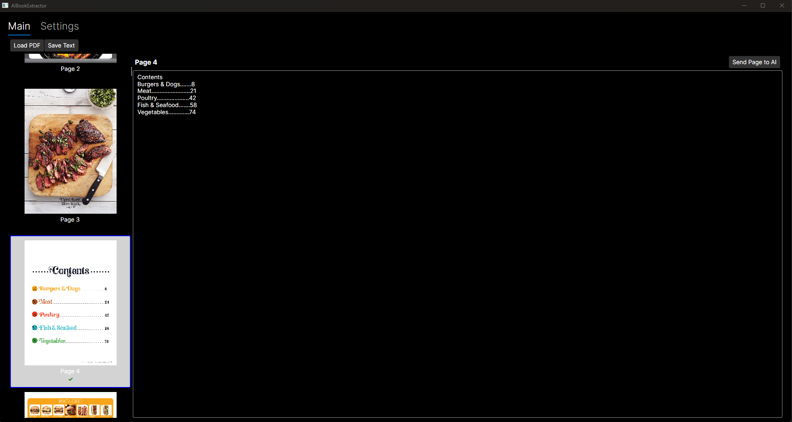

# AI Book Extractor

AI Book Extractor is a .NET application built with Avalonia UI framework that allows you to process PDF files, convert them to images, and extract text content. The application supports AI-assisted text processing capabilities.

## Features

- PDF to image conversion
- Page-by-page processing
- Progress tracking for long operations
- Automatic saving of processed content
- Support for resuming interrupted processing
- AI-assisted text processing capabilities

## Building the Project

1. Clone the repository
2. Ensure you have .NET 8.0 SDK installed
3. Run the following commands:

```bash
dotnet restore
dotnet build
```



## Future Features
- Set default AI to use
- Fully Implement AI calls
- Adjust Save Location